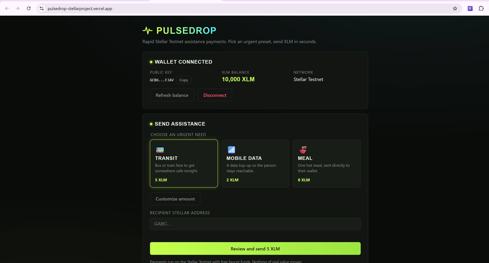
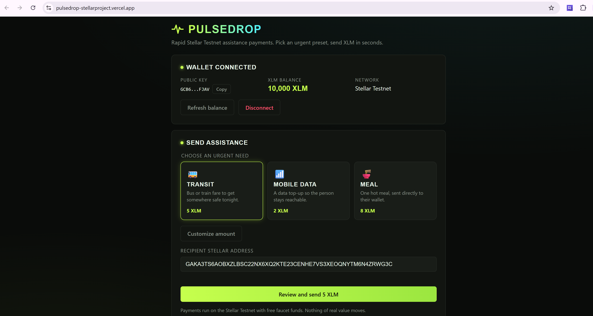
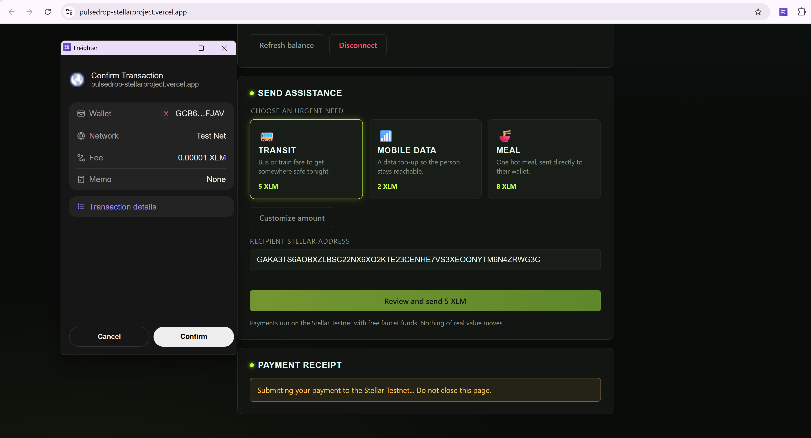
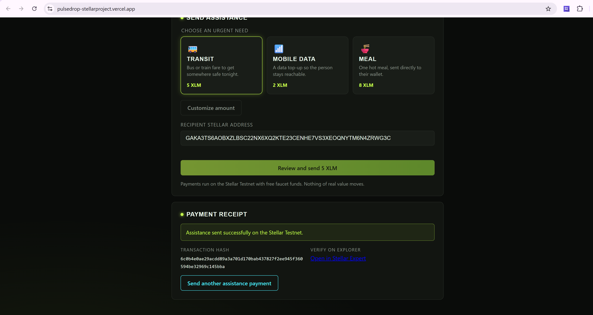
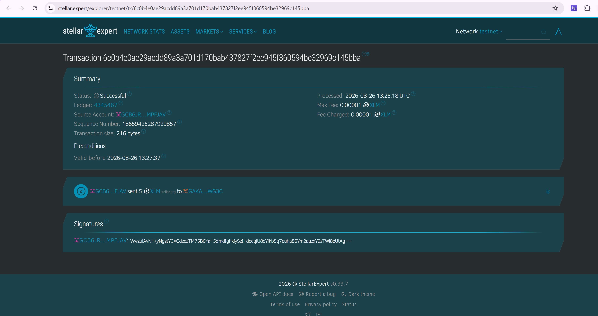

# PulseDrop

PulseDrop is a rapid Stellar Testnet assistance-payment interface. Instead of a
generic payment form, users pick an urgent preset — **Transit**, **Mobile
Data**, or **Meal** — or enter a custom amount, and send XLM directly to the
recipient's wallet with a clearly explained pending/success/failure receipt.

> ⚠️ **Testnet only.** PulseDrop runs exclusively against the Stellar Testnet.
> Balances come from the free friendbot faucet and have no monetary value.
> Never enter a real secret key anywhere in this app.

## Features

- Multi-wallet connection through Stellar Wallets Kit v2 (Freighter, Albedo,
  xBull, Rabet, LOBSTR, and other supported providers)
- Explicit Testnet network guard that locks payments until Freighter is on Testnet
- Live XLM balance display with refresh action
- Three urgent assistance presets plus a custom amount mode
- Client-side validation of recipient address and amount (including fee headroom)
- Full payment lifecycle: build → sign in Freighter → submit to Horizon → confirm
- Pending, success, and failure receipt states with transaction hash and a
  [Stellar Expert](https://stellar.expert) Testnet explorer link
- Duplicate-submission lock while a transaction is pending
- Distinct error messages for: missing wallet, dismissed access request,
  dismissed signing, wrong network, invalid address, insufficient balance,
  malformed transactions, and Horizon outages

## Prerequisites

- **Node.js 18+** (tested on Node 20 and 24)
- npm 9+
- The [Freighter browser extension](https://www.freighter.app/) installed
- A funded Testnet account inside Freighter. If your account has no XLM,
  request funds from the [friendbot faucet](https://friendbot.stellar.org/)
  by entering your public address in its URL:
  `https://friendbot.stellar.org/?addr=<YOUR_PUBLIC_KEY>`
- Set Freighter's network to **Test Network** (extension settings)

## Local Setup

```bash
# 1. Clone the repository
git clone https://github.com/vaultsarcane-cmd/pulsedrop-stellarproject.git
cd pulsedrop-stellarproject

# 2. Install dependencies
npm install

# 3. Start the development server
npm run dev
```

Open `http://localhost:5173` in the browser where Freighter is installed.

## Environment Variables

Copy `.env.example` to `.env` (the verified Testnet deployment is already included):

```env
VITE_CONTRACT_ID=CA67LHULSLWR6NNSUBVWSJTJOISRFSUZNPXGRIGN42DFDQEOQ5JCTGVX
VITE_SOROBAN_RPC_URL=https://soroban-testnet.stellar.org
```

You can override the contract ID for a later deployment. Classic XLM payments
and contract calls remain Testnet-only.

## Available Scripts

| Command           | Description                          |
| ----------------- | ------------------------------------ |
| `npm run dev`     | Start the Vite dev server            |
| `npm run build`   | Typecheck + production build         |
| `npm run preview` | Preview the production build locally |
| `npm test`        | Run unit tests (Vitest)              |
| `npm run lint`    | Lint with ESLint                     |
| `npm run typecheck` | TypeScript project check           |

## Architecture

```
src/
├── components/       # WalletCard, PaymentForm, ReceiptCard UI sections
├── hooks/
│   ├── useWallet.ts             # Freighter lifecycle + balance state
│   ├── usePayment.ts            # Build/sign/submit lifecycle + receipt state
│   └── useCopyToClipboard.ts    # Copy feedback for the public key
├── services/
│   ├── walletSelector.ts # Stellar Wallets Kit v2 connection/signing state
│   ├── contract.ts   # Soroban RPC simulation, signing, submission, events
│   ├── freighter.ts  # Legacy direct-payment signing wrapper
│   └── horizon.ts    # Balance lookup + payment submission via stellar-sdk
├── lib/
│   ├── presets.ts    # Assistance presets + input validation rules
│   └── format.ts     # Key abbreviation, amount formatting, validation
└── styles/           # Dark design tokens, shell, component styles
```

The app never touches secret keys: transactions are built as unsigned XDR,
handed to Freighter for signing, and only the signed envelope is submitted.

## Screenshots


_Freighter connected on Stellar Testnet with the public key and XLM balance visible._


_Transit assistance preset selected with a validated Testnet recipient._


_Freighter confirmation and PulseDrop's submitting state during the live payment._


_Successful Testnet receipt with the transaction hash and explorer action._


_The same payment independently verified as successful on Stellar Expert._

## Verified Example Transaction

A real Testnet payment made during manual verification:

- Transaction hash: `6c0b4e0ae29acdd89a3a701d170bab437827f2ee945f360594be32969c145bba`
- Explorer link: [View the successful Testnet payment on Stellar Expert](https://stellar.expert/explorer/testnet/tx/6c0b4e0ae29acdd89a3a701d170bab437827f2ee945f360594be32969c145bba)

## Contract build and deployment

The assistance contract is deployed and verified on Stellar Testnet:

- Contract ID: `CA67LHULSLWR6NNSUBVWSJTJOISRFSUZNPXGRIGN42DFDQEOQ5JCTGVX`
- [View the contract on Stellar Expert](https://stellar.expert/explorer/testnet/contract/CA67LHULSLWR6NNSUBVWSJTJOISRFSUZNPXGRIGN42DFDQEOQ5JCTGVX)
- Verified contract-call transaction: `ad1ff48f6024742b6c7219398219db003fce066174ca61831c64127a5abd56ac`
- [View the contract call on Stellar Expert](https://stellar.expert/explorer/testnet/tx/ad1ff48f6024742b6c7219398219db003fce066174ca61831c64127a5abd56ac)
- [Successful deployment workflow](https://github.com/vaultsarcane-cmd/pulsedrop-stellarproject/actions/runs/34578819193)

Install the current Stellar CLI, then run:

```bash
stellar contract build --manifest-path contracts/assistance/Cargo.toml
stellar keys generate pulsedrop-deployer --network testnet --fund
stellar contract deploy \
  --wasm target/wasm32v1-none/release/pulsedrop_assistance.wasm \
  --source-account pulsedrop-deployer \
  --network testnet
```

Put the returned `C...` address in `.env` when deploying a replacement contract.

### Deploy without installing Stellar CLI locally

The repository includes two GitHub Actions workflows:

- `CI` runs frontend tests, lint, production build, Rust tests, and the contract
  WASM build on every push and pull request.
- `Deploy contract to Testnet` is a manual workflow that builds and deploys the
  contract from an Ubuntu runner.

Run **Actions → Deploy contract to Testnet → Run workflow**, or push a tag named
`deploy-testnet-*`. The workflow generates and funds an ephemeral Testnet-only
deployer on the runner, deploys the contract, performs one authenticated write,
and extracts its transaction hash from the emitted event. The run summary shows
the contract and transaction Explorer links. Its artifact contains the optimized
WASM, decoded event, and a ready-to-copy `pulsedrop-testnet.env` file. No secret
is required and no deployer key is retained after the runner is destroyed.

## Troubleshooting

| Symptom | Fix |
| --- | --- |
| "No Stellar wallet detected" | Install Freighter from freighter.app and reload the page. |
| Payments locked with a wrong-network warning | Switch Freighter to Test Network, then press Retry Testnet check. |
| "Balance unavailable" | Fund the account via friendbot, then press Refresh balance. |
| Signing dismissed | Nothing was sent; press Review and send again when ready. |

## License

MIT
